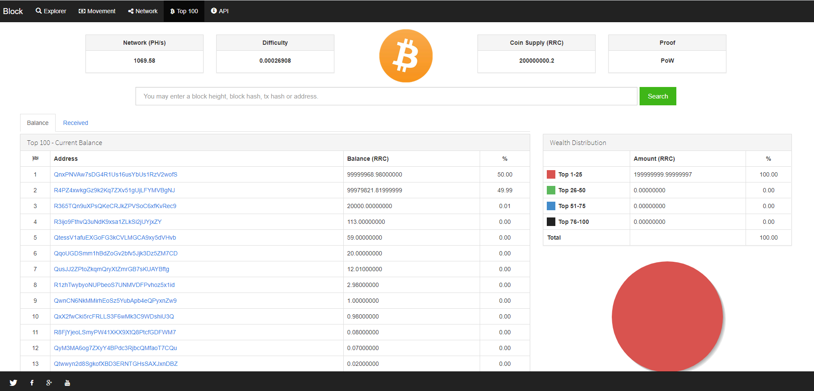
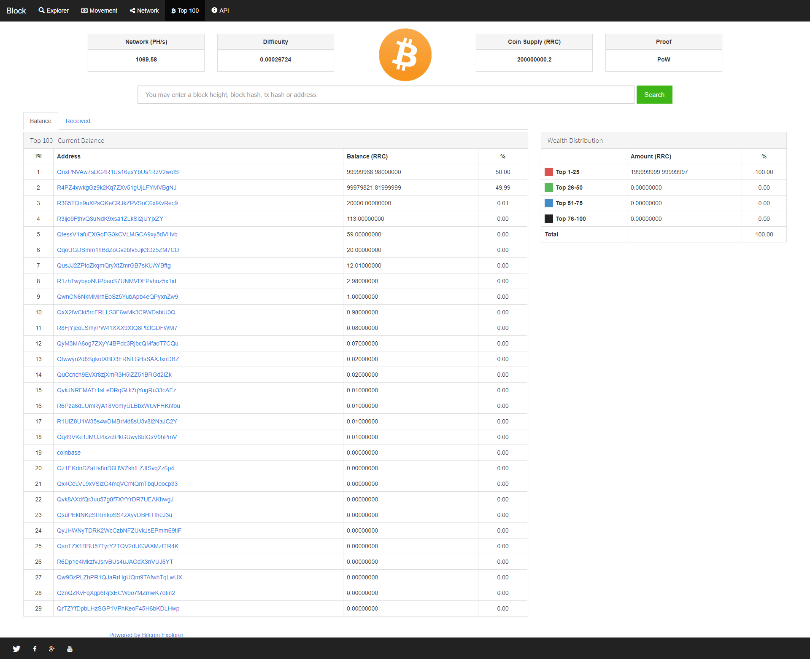
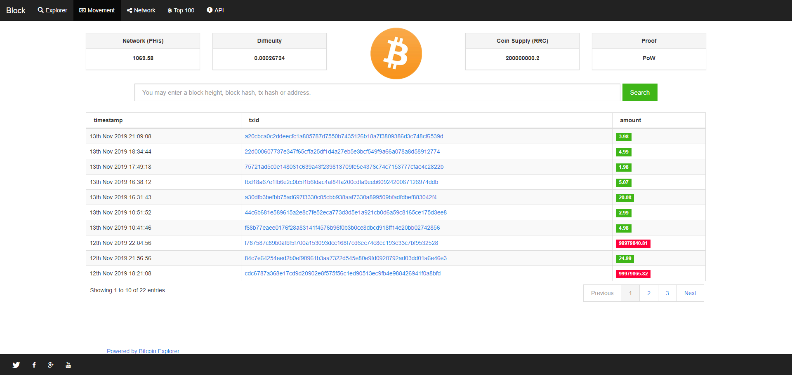
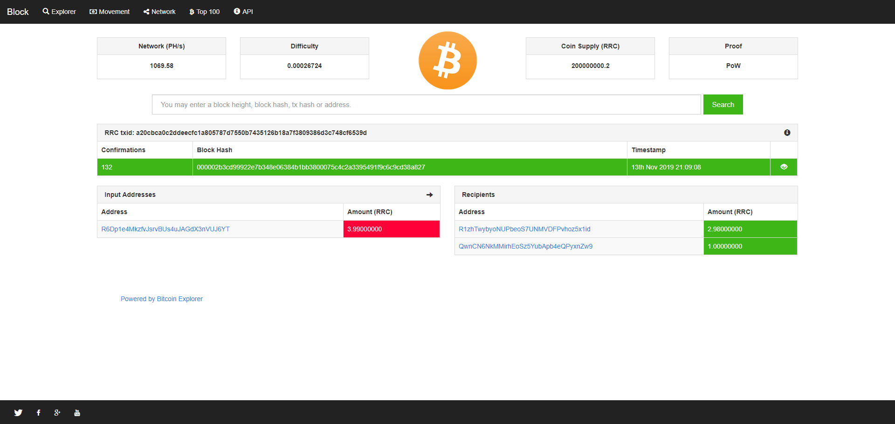
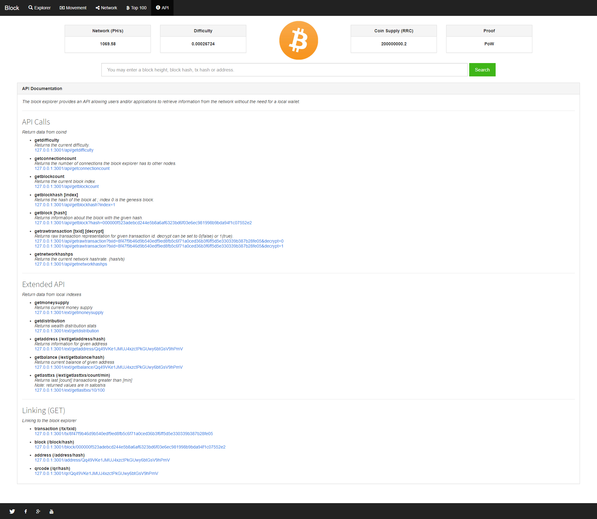
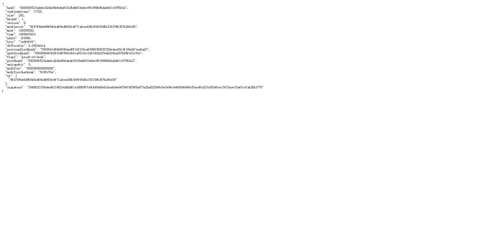
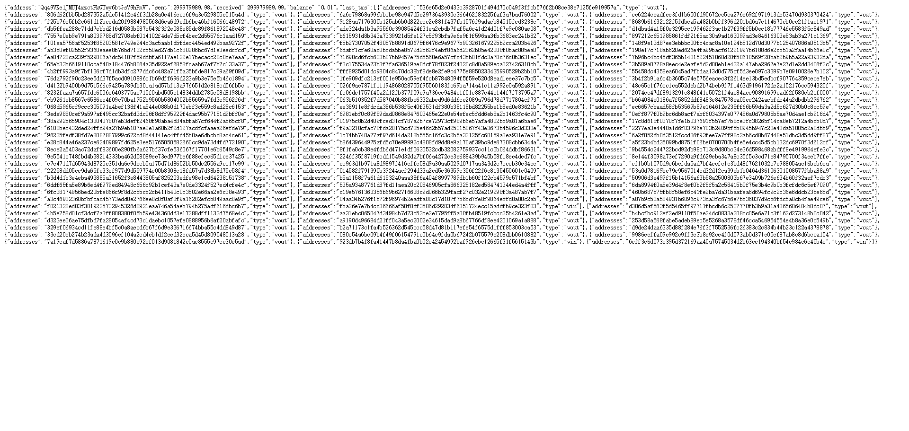
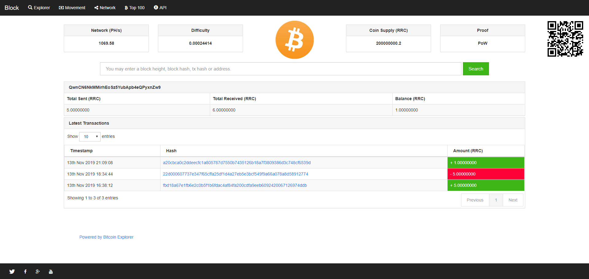
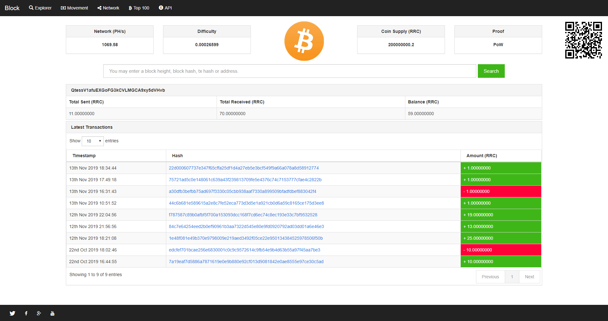

# 专业版 区块浏览器 带余额排行 高端大气 17种风格

演示地址：http://block.demo.cnhttp.cn/

Ver 2.01版本升级日志

1：全站ui用到的js以及css做了优化精简，系统更流畅。

2：针对BTC，USDT以及山寨币接口简易部署，方便。

3：增强主流浏览器的兼容性。

4：完美运营版。

最新区块浏览器功能：

1：币种算法，SHA-256。

2:   证明方式： PoW

3:   根据钱包地址查询区块高度，区块hash，明细tx。

4:   根据钱包区块高度查询钱包地址，区块hash，明细tx。

5:   根据钱包区块hash查询tx，区块地址，明细tx，区块高度。

6:   根据钱包区块明细tx查询区块hash，区块地址，明细tx，区块高度。

7：统计币排行前一百的钱包地址。

8：显示目前所有区块币总量。

9：显示目前挖矿难度。

10：提供API余额接口。

11：API明细接口。

12：API近20个接口，全开放。

13：前端17种色调模板可以随意调换。

14：采用目前先进的VUE技术。

## Screenshots

我们不仅提供源码，还提供钱包对接服务，具体详情，欢迎咨询！
亲爱的各位买家朋友，如何懂源码就直接购买，不懂配置请支付配置费用，我们帮您配置；
不要以各种理由说什么不完整的问题，既然我销售源码就一定会提供完整版的。
1.在使用本系统时，使用方必须在国家相关法律法规范围内并经过国家相关部门的授权许可，禁止用于一切非法行为。
2.本系统的使用用途仅限于测试、实验、研究为目的，禁止用于一切商业运营，本团队不承担使用者在使用过程中的任何违法行为负责。

注：
1、请勿以无法对接或者其他相关问题退款，本店所有技术服务均为收费费用；
2、商品设置的安装调试只是单网站运行环境配置，不包含其它任何相关配置；
3、如源码存在问题可以购买的技术服务；本店承接数字资产相关服务；
4、网站相关接口均为收费配置；
5、请不要以任何这样那样的问题说程序无法运行；

描述此节主要防止骗取源码朋友，报骗取源码心态请绕行；
我们尽快我们所服务能力服务好我们忠实用户；
